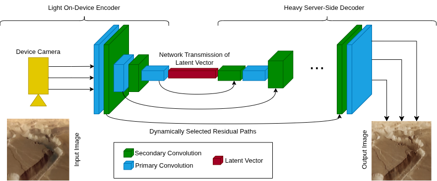
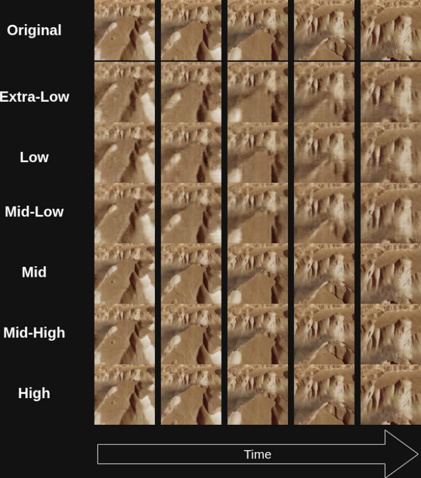
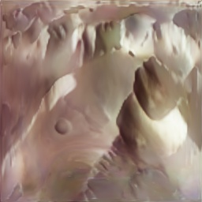
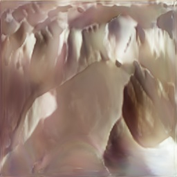
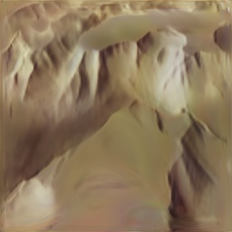
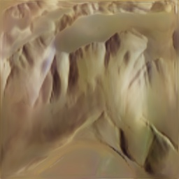
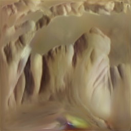

# LeHd: Light Encoder Heavy Decoder CNN Architecture for Dynamic Video Streaming

## Abstract

Using Convolutional Neural Networks for video encoding is a continuously evolving field of research driven by the need of streaming high quality video from mobile devices in areas with variable network bandwidth, such as drones, space vehicles, and other off-the-grid equipment. This project introduces **LeHd**, a fast and accurate approach to dynamically encode and decode video streams based on real-time available bandwidth.

### Key Features

- **Light Encoder**: Runs on the device (mobile, drone, etc.) with minimal computational overhead
- **Heavy Decoder**: GPU-capable server that performs intensive reconstruction
- **Six Operating Modes**: Dynamic switching between modes based on available bandwidth
- **High Efficiency**: Achieves 30 FPS encoding on device with stable reconstructions at highest compression
- **Adaptive Transmission**: Variable amount of residual matrices transmitted based on bandwidth availability

The architecture was evaluated on aerial footage, simulating real-time transitions between transmission modes.

---

## Source Files Overview

### 1. **LeHd.py** — Core Model Architecture

The main implementation of the Light Encoder-Heavy Decoder architecture.

**Components:**

- **LeHdEncoder** (Light)
  - Lightweight encoder running on the device
  - Based on a fine-tuned ResNet18 backbone
  - Encodes input frames into compact latent vectors
  - Saves residual skip connections for transmission to server
  - Extracts residuals at multiple scales (6 modes of operation)
  - Mode 0: Base latent only (minimum bandwidth)
  - Modes 1-5: Progressive addition of residual detail layers
  
- **LeHdDecoder** (Heavy)
  - GPU-resident decoder running on server
  - Reconstructs high-quality images from encoded payload
  - Uses residual fusion blocks to incorporate transmitted detail layers
  - Upscales compressed latents back to original resolution (256×256)
  - Features learned sigmoid gates to optimally blend residual information

- **Supporting Components:**
  - `ResidualHead`: Lightweight depthwise-separable convolutions for efficient residual extraction
  - `ResidualFusion`: Server-side learned gating mechanism for residual integration
  - `EncoderOutput`: Dataclass managing transmission payload (base latent + residuals + optional skips)

**Key Innovation:** The mode system allows bandwidth-adaptive encoding where more residual layers are transmitted as bandwidth increases, providing graceful quality degradation.

---

### 2. **PerceptualLoss.py** — Loss Functions

Implements advanced loss functions for training and optimization.

**Implemented Loss Functions:**

- **PerceptualLoss (VGG-based)**
  - Feature-space loss using VGG16 pretrained on ImageNet
  - Compares activations at `relu2_2` and `relu3_3` layers
  - Produces sharper reconstructions than pixel-level MSE alone
  - Essential for high-quality compression, especially in mode 0
  - Emphasizes structural quality over color accuracy

- **DINOPerceptualLoss (Vision Transformer-based)** [Recommended Alternative]
  - Uses DINO self-supervised model for semantic-aware loss
  - Available models:
    - `dinov2_vits14` — Best speed/quality trade-off (21M params)
    - `dinov2_vitb14` — Highest quality (86M params)
  - Extracts features at multiple ViT layers for multi-scale perception
  - Shape-biased (better for semantic content vs texture)
  - Particularly effective for talking heads and detailed facial features
  - Outperforms VGG for perceptual quality in human-centric content

- **Additional Losses:**
  - `FrequencyLoss`: Captures color and frequency domain accuracy
  - `MSELoss`: Pixel-level reconstruction accuracy
  - Combined training: λ_mse × MSE + λ_perc × Perceptual + λ_freq × Frequency

---

### 3. **Helpers.py** — Training Utilities

Contains training pipeline and helper functions.

**Key Functions:**

- **train_on_video()**
  - Main training loop for video-based model optimization
  - **Parameters:**
    - `video_path`: Path to input video file
    - `mode`: Bandwidth mode (0-5) to train at
    - `size`: Frame resolution (default 256×256)
    - `device_str`: Training device ('mps', 'cuda', 'cpu')
    - `lr`: Learning rate (default 1e-4)
    - `λ_mse`, `λ_perc`, `λ_freq`: Loss weights for MSE, perceptual, and frequency loss
    - `save_every`: Checkpoint interval

  - **Improvements in v2:**
    - Proper BGR→RGB color space conversion (OpenCV reads BGR)
    - Explicit mode passing to model
    - Combined perceptual + frequency loss
    - Gradient clipping (norm ≤ 1.0) for stability
    - Periodic checkpointing every N frames
    - Separate train/eval mode handling

  - **Processing Pipeline:**
    1. Load video frame-by-frame
    2. Convert BGR (OpenCV) → RGB color space
    3. Resize to target resolution
    4. Convert to tensor (normalized [0, 1])
    5. Encode using selected mode
    6. Compute multi-component loss
    7. Backprop with gradient clipping
    8. Display live inference with loss metrics
    9. Save checkpoints periodically

---

### 4. **main.py** — Benchmarking & Testing

Comprehensive testing and performance benchmarking script.

**Functionality:**

- **Model Initialization**
  - Creates encoder and decoder on specified device (MPS, CUDA, or CPU)
  - Loads weights from checkpoint if available

- **Mode Validation**
  - Tests all 6 operating modes (0-5)
  - Verifies output shapes and value ranges
  - Prints payload size for each mode
  - Estimates bandwidth requirements

- **Throughput Benchmarking**
  - Measures encoder FPS (frames per second)
  - Runs 200-frame test on device
  - Accounts for GPU synchronization time
  - Typical result: ~30 FPS on modern hardware

- **Parameter Counting**
  - Reports encoder parameters (runs on device)
  - Reports decoder parameters (runs on server)
  - Total model size
  - Helps assess deployment resource requirements

- **Training Integration**
  - Automatically launches training pipeline after testing
  - Trains on specified video with selected mode
  - Saves checkpoints to model directory

---

## Screenshots & Results

### Architecture Overview
Model architecture showing the light encoder on the device and heavy decoder on the server:



---

### Performance Metrics
Benchmark results showing throughput and efficiency:



---

### Quality Comparison - Frame 1

**Mode 0 (Minimum Bandwidth)** - Original vs Reconstruction:


**Mode 3 (Medium Bandwidth)** - Better quality with additional residuals:


---

### Training Progress Examples

Progressive training results at different frame counts (all in Mode 0):

**Frame 1300:**


**Frame 1400:**


**Frame 1500:**


**Frame 1600:**


**Frame 1700:**


---

## Operating Modes

LeHd supports 6 bandwidth-adaptive modes:

| Mode | Components | Bandwidth | Quality | Use Case |
|------|-----------|-----------|---------|----------|
| 0 | Base latent only | Minimum | Basic (stable) | Critical bandwidth constraints |
| 1 | Base + 1 residual | Low | Fair | Severely limited bandwidth |
| 2 | Base + 2 residuals | Low-Medium | Good | Limited bandwidth |
| 3 | Base + 3 residuals | Medium | Very Good | Standard conditions |
| 4 | Base + 4 residuals | Medium-High | Excellent | Good bandwidth |
| 5 | Base + 5 residuals + skips | High | Ultra-High | Abundant bandwidth / local storage |

---

## Implementation Details

### Device-Server Communication

1. **Encoding (Device)**
   - Input: 256×256 RGB frame
   - Process: ResNet18 → latent extraction → residual head networks
   - Output: Compact `EncoderOutput` payload
   - Throughput: ~30 FPS

2. **Transmission**
   - Payload size varies by mode (Mode 0: ~8 KB, Mode 5: ~100+ KB)
   - Only residuals needed are transmitted
   - Allows dynamic bandwidth adaptation

3. **Decoding (Server)**
   - Input: `EncoderOutput` payload
   - Process: Upsample latent → fuse residuals with learned gates → refinement
   - Output: 256×256 RGB reconstruction
   - Quality improves with each additional residual

### Loss Function Strategy

Training uses a weighted combination:
```
Total Loss = 1.0 × MSE_Loss + 0.5 × Perceptual_Loss + 0.2 × Frequency_Loss
```

This balances:
- **MSE**: Pixel-level fidelity
- **Perceptual**: Structural and semantic quality (VGG or DINO features)
- **Frequency**: Color accuracy and high-frequency details

---

## Getting Started

### Requirements
- Python 3.8+
- PyTorch with GPU support (CUDA or MPS)
- OpenCV (`cv2`)
- NumPy, TorchVision

### Running Benchmarks
```bash
cd src
python main.py
```

This will:
1. Test all 6 modes
2. Benchmark throughput
3. Print parameter counts
4. Begin training on `datasets/movie3.mp4`

### Custom Training
```python
from Helpers import train_on_video

train_on_video(
    video_path="path/to/video.mp4",
    model_path="path/to/checkpoint.pth",
    mode=3,  # Train on medium bandwidth mode
    device_str="mps",  # or "cuda"
    lr=1e-4
)
```

---

## Results

- **Encoding Speed**: 30 FPS at 256×256 resolution
- **Compression Modes**: 6 levels of bandwidth-quality trade-offs
- **Quality at Max Compression**: Stable, recognizable reconstructions even in Mode 0
- **Server Processing**: Real-time decoding on GPU-capable systems
- **Deployment**: Suitable for drones, mobile devices, and bandwidth-constrained scenarios

---

## License

See LICENSE file for details.
